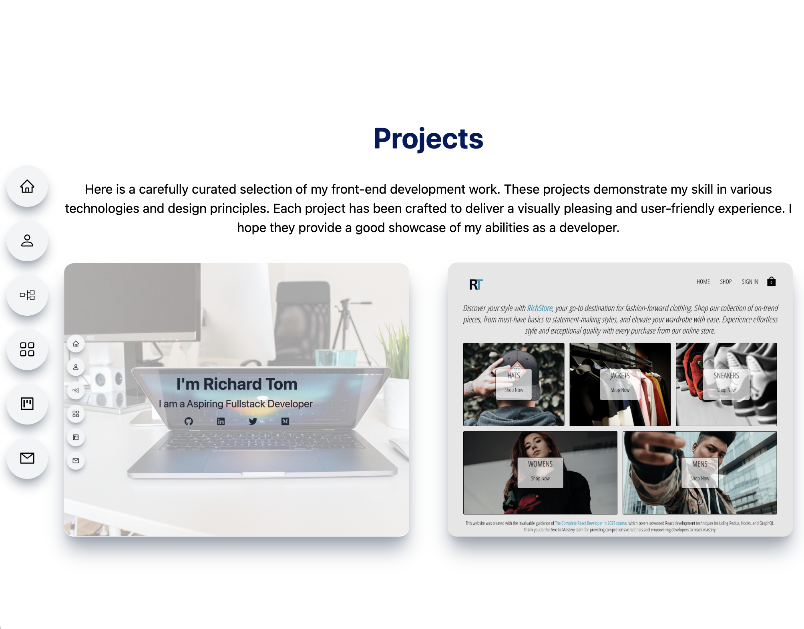

# My Portfolio/Landing page

This is my portfolio which will be continually improved overtime.

## Table of contents

- [Overview](#overview)
  - [Screenshot](#screenshot)
  - [Links](#links)
- [My process](#my-process)
  - [Built with](#built-with)
  - [What I learned](#what-i-learned)
  - [Continued development](#continued-development)
- [Author](#author)
- [Acknowledgments](#acknowledgments)

## Overview

### Screenshot

Main Page:

Project Page:

### Links

- [View Github Repository](https://github.com/r-tom90/portfolio.git)
- [View Live Site](https://richard-tom-portolio.vercel.app/)

## My process

### Built with

- CSS custom properties
- Flexbox
- CSS Grid
- [Tailwind CSS](https://tailwindcss.com/#what-is-tailwind) - For styles
- Mobile-first workflow
- [React](https://reactjs.org/) - JS library
- [Vite](https://vitejs.dev/) - React Bootstrap

### What I learned

- Use of React functional components through bootstrapping Vite.
- The ease of CSS usage with Tailwind CSS.

### Continued development

- Implementation of:
  - [x] Dark Mode
  - Blogging.
  - Web3 Authentication with NFT.

## Author

- Website - [Portfolio deployed with vercel](https://richard-tom-portolio.vercel.app/)
- GitHub - [@r-tom90](https://github.com/r-tom90)
- LinkedIn - [@richard-tom](https://www.linkedin.com/in/richard-tom-81b0956b/)
- Twitter - [@CryptoFallen](https://twitter.com/CryptoFallen)
- Medium - [@richardtom](https://medium.com/@richardtom_79153)

## Acknowledgments

This was built with the tutorial from the [Code Commerce YouTube Channel](https://www.youtube.com/watch?v=22CxRxryQFE&list=PLRz-nDZjTFgcdEdy7LfB5AcYsTtGxX59j&index=39).
